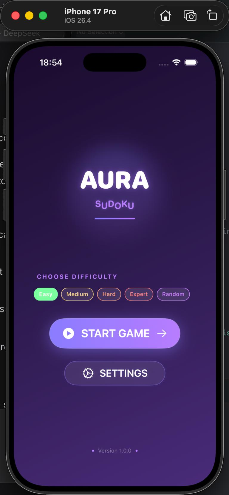
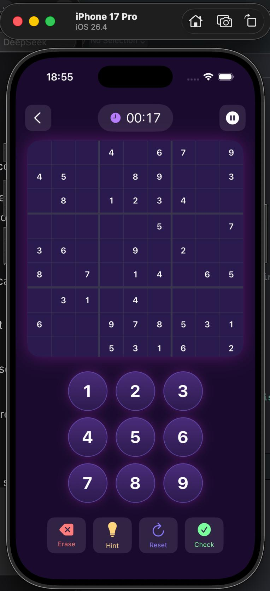
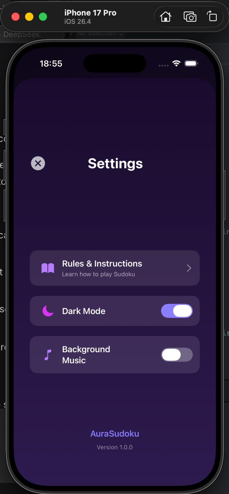

# 🎮 Aura Sudoku

A Sudoku puzzle game built with **Swift** and **Xcode**, featuring a clean and interactive interface designed to provide a simple and enjoyable puzzle-solving experience.

## ✨ Features

- 🎯 Interactive Sudoku gameplay
- 🧩 Multiple difficulty levels
- 🔢 Interactive number pad
- 🌙 Dark mode support
- ⚙️ Settings screen
- 🏆 Win/completion screen
- 🔊 Audio effects
- 🎨 Custom UI design

## 🛠 Technologies

- Swift
- SwiftUI
- Xcode

## 📱 Screenshots

### Main Menu

### Game Screen

### Settings

### Win Screen

### App Icon

## 🎥 Demo

A video demonstration of the app is available here:

**[Watch the Demo](https://drive.google.com/drive/folders/1gWjiPjD_ISvYqBLyYuyE2iX44p_nLt2n)**

## 🎯 Project Goal

The goal of this project was to develop a functional Sudoku game while practicing Swift programming, user interface design, game logic, and problem-solving.

## 👩‍💻 Author

**Sohiba Abdullayeva**

Applied Mathematics Student  
New Uzbekistan University
